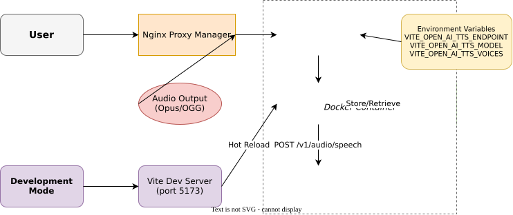

# Echo: Multi-Model Voice Studio - Browser Client

[](https://www.typescriptlang.org/)
[](https://reactjs.org/)
[](https://vitejs.dev/)

Echo: Multi-Model Voice Studio provides a comprehensive platform for converting text to speech, speech to text, voice changing, and sound effect generation using multiple state-of-the-art models including EchoTTS, Qwen3-TTS (opensource), FishAudio S1-mini, IndexTTS2, Vibe Voice, Chatterbox, Alibaba Qwen-TTS, and MossSFX. Features include dynamic voice creation, real-time streaming (for supported models), user authentication via Supabase, STT transcription with timestamp support, voice changing with LinaCodec VC, AI-powered sound effect generation with MOSS-SoundEffect, and persistent audio history.

## ✨ Features

### Core TTS Functionality
- **🎵 Stream & Play**: Plays audio as chunks arrive (low-latency streaming)
- **📚 Persistent History**: Keeps the last 5 generated audio clips in IndexedDB for quick replay
- **💾 Download Support**: Export generated audio files as `.ogg` (Opus) format
- **🔄 Auto-play**: Generated audio plays automatically with fallback handling

### Dynamic Voice Creation
- **🎤 Voice Recording**: Record audio directly from microphone or upload audio files (.wav, .ogg, .m4a, .mp3)
- **✏️ Custom Voices**: Create personal reference voices (30-60 seconds) with admin approval workflow
- **👥 User Roles**: Tiered access system (user → voice_creator → admin) via Supabase authentication
- **📊 Voice Management**: Dynamic voice listing replacing static configuration, real-time updates
- **🔒 Quota System**: Fair usage with 20 voice limit per user to prevent abuse

### Speech-to-Text (STT) Features
- **📝 Audio Transcription**: Upload audio files (.m4a, .mp3, .wav, .ogg, .opus) up to 30 minutes
- **⏱️ Timestamp Support**: Optional word and segment-level timestamps in transcription output
- **📤 Direct S3 Upload**: Presigned URLs for secure, direct-to-S3 file uploads
- **🤖 RunPod Serverless**: NVIDIA Parakeet model for accurate transcription
- **💬 Copy & Download**: Copy transcription to clipboard or download as .txt file
- **🖱️ Drag & Drop**: Intuitive file upload with visual feedback
- **🔓 Open Access**: No authentication required for STT functionality

### Voice Changing Features
- **🎭 Voice Conversion**: Transform source audio with target voice timbre using AI
- **🎤 Dual Audio Input**: Upload or record source (content) and target (voice) audio files
- **📤 S3 Upload Pipeline**: Direct S3 uploads with presigned URLs for both audio inputs
- **🤖 RunPod Serverless**: LinaCodec VC model for voice conversion processing
- **🎵 Audio Formats**: Supports .m4a, .mp3, .wav, .ogg, .opus, and .webm (recordings)
- **🖱️ Drag & Drop + Recording**: File upload with visual feedback or direct microphone recording
- **💾 Download Results**: Play and download converted audio output
- **⏳ Progress Tracking**: Real-time upload and processing progress indicators
- **🔓 Open Access**: No authentication required for voice changing

### SoundFX Features
- **🔊 Text-to-Sound Effect**: Generate ambient soundscapes and sound effects from text descriptions
- **🎯 Prompt Guidance**: UI guidance emphasizing environmental/ambient descriptions (the model's strength)
- **⏱️ Duration Control**: Specify target duration from 1-30 seconds via slider
- **🎛️ Advanced Parameters**: Collapsible section with temperature, top_p, top_k, and repetition_penalty sliders (defaults match model recommendations)
- **🤖 RunPod Serverless**: MOSS-SoundEffect (8B) model for high-fidelity audio generation
- **🎵 WAV Output**: Native 24kHz WAV output with inline audio player
- **💾 Download Support**: Download generated sound effects as WAV files
- **📊 Generation Metadata**: Display actual duration and generation time
- **🔓 Open Access**: No authentication required for sound effect generation

### Platform Features
- **🔐 Supabase Auth**: Secure user authentication with role-based access control (TTS only)
- **🗃️ Database-Backed**: PostgreSQL-backed voice metadata and request tracking
- **☁️ Cloud Storage**: S3-compatible storage for voice files, STT, and Voice Changing audio uploads
- **🔧 Runtime Configuration**: Change API endpoints and models via environment variables without rebuilding
- **🎨 Modern UI**: Clean Material-UI interface with tab navigation and light/dark theme toggle
- **🪝 Custom Hooks Architecture**: Modular, reusable React hooks for clean separation of concerns
- **♻️ Optimized Performance**: Built with React best practices and modern ES2022 features
- **🐳 Docker Ready**: Containerized for internal `shared_net` usage with Nginx Proxy Manager

## 🏗️ Architecture



Echo TTS employs a comprehensive multi-service architecture with authentication, database storage, and dynamic voice management:

### Core Services
- **Frontend** (React/TypeScript): Tab-based UI with TTS, STT, Voice Changing, SoundFX, and voice management
- **Express Server** (port 4173): Serves static files, injects runtime env vars, STT/Voice Changing/SoundFX proxy endpoints
- **TTS Bridge Service**: OpenAI-compatible API endpoint with voice management and Supabase integration
- **RunPod Serverless**: TTS audio processing, STT transcription (NVIDIA Parakeet), Voice Changing (LinaCodec VC), SoundFX (MOSS-SoundEffect)
- **Supabase**: Authentication, PostgreSQL database, and real-time subscriptions
- **S3 Storage**: Voice files, STT/Voice Changing audio uploads with presigned URLs, SoundFX output delivery, lifecycle management

### Deployment Architecture
- **Docker Container**: Runs on `shared_net` network without host port exposure
- **Nginx Proxy Manager**: Routes external traffic to the container
- **Production Mode**: Express server serves static files with runtime env injection
- **Development Mode**: Vite dev server (port 5173) with hot module replacement

### Authentication & Authorization Flow
1. User authenticates via Supabase (JWT tokens)
2. Roles: `user` (default) → `voice_creator_pending` → `voice_creator` → `admin`
3. Bridge service validates JWTs and enforces role-based access
4. Admin approval required for voice creation permissions

### Voice Creation Pipeline
1. **Upload**: Users upload/record 30-60s audio to S3 (uploads/ prefix)
2. **Registration**: Bridge registers voice in database with `pending` status
3. **Approval**: Admin reviews and approves requests via UI
4. **Processing**: Bridge normalizes audio to .ogg Opus format
5. **Deployment**: Processed files stored in S3 (processed/) and RunPod shared volume
6. **Availability**: Voice becomes available in TTS service

### Voice Changing Pipeline
1. **Input**: Users upload or record two audio files (source + target)
2. **Validation**: Client-side file format and size validation
3. **Presigned URLs**: Client requests S3 presigned PUT URLs from `/api/voice-change/presign`
4. **S3 Upload**: Both audio files uploaded directly to S3 via presigned URLs
5. **Processing**: Server proxies request to RunPod Serverless (LinaCodec VC)
6. **Result**: Converted audio returned as presigned URL for playback and download

### SoundFX Pipeline
1. **Input**: User enters a text description and optional duration (1-30 seconds)
2. **Proxy**: Server forwards request to RunPod Serverless (`/runsync`) with Bearer token
3. **Generation**: MOSS-SoundEffect model generates audio from text description
4. **Upload**: MossSFX worker uploads WAV to its own S3 bucket
5. **Result**: Presigned URL returned for inline playback and download

### Data Flow
1. User input flows through React components with authentication context
2. TTS requests go through bridge service with role validation
3. Audio responses stored as blobs in IndexedDB with automatic cleanup
4. Voice metadata managed in PostgreSQL with real-time updates
5. Audio files processed and stored in S3 with local caching

### Frontend Architecture
- **Authentication Context**: Supabase auth state management
- **Custom Hooks**: Modular logic for TTS, audio playback, history, URL lifecycle
- **Theme Context**: Dynamic light/dark mode switching with MUI theming
- **TypeScript**: Full type safety with ES2022 target
- **State Management**: React hooks with memoization and real-time updates

## 🚀 Quick Start

### Prerequisites

- [Node.js](https://nodejs.org/) 18+
- [Docker](https://www.docker.com/) and Docker Compose
- OpenAI-compatible TTS service
- Supabase project (for authentication and database)
- S3-compatible storage service (for voice file storage)

### Docker Deployment (Recommended)

1. **Setup Supabase**:
   - Create a new Supabase project
   - Run `supabase/sql/001_schema.sql` in the Supabase SQL Editor
   - Create an admin user in the `user_roles` table
   - Get your Supabase URL and keys

2. **Create network** (if not exists):
   ```bash
   docker network create shared_net
   ```

3. **Configure environment**:
   Create a `.env` file with your configuration:
   ```bash
   # TTS Configuration
   TTS_ENDPOINT=http://your-tts-service:8000/v1/audio/speech
   TTS_MODEL=gpt-4o-mini-tts

   # Supabase Configuration
   VITE_SUPABASE_URL=https://your-project.supabase.co
   VITE_SUPABASE_ANON_KEY=your-anon-key
   SUPABASE_SERVICE_KEY=your-service-key

   # S3 Configuration (for voice storage)
   S3_BUCKET=your-bucket
   S3_REGION=us-east-1
   S3_ACCESS_KEY=your-access-key
   S3_SECRET=your-secret-key

   # Bridge API Configuration
   BRIDGE_API_URL=http://your-bridge-service:3000
   ```

4. **Deploy**:
   ```bash
   docker-compose up -d --build
   ```

5. **Configure Nginx Proxy Manager**:
   Forward traffic to `echo-tts-ui` container on port `4173`

6. **Access the application**:
   - Open your browser to the configured domain
   - Sign in with Supabase auth
   - Admin users can approve voice creation requests

### Local Development

1. **Clone and install**:
   ```bash
   git clone https://github.com/your-org/echo-tts-app.git
   cd echo-tts-app
   npm install
   ```

2. **Setup environment**:
   Create `.env.local` with your configuration:
   ```bash
   # TTS Configuration
   VITE_OPEN_AI_TTS_ENDPOINT=http://localhost:8000/v1/audio/speech
   VITE_OPEN_AI_TTS_MODEL=gpt-4o-mini-tts

   # Supabase Configuration
   VITE_SUPABASE_URL=https://your-project.supabase.co
   VITE_SUPABASE_ANON_KEY=your-anon-key

   # Bridge API Configuration
   VITE_BRIDGE_API_URL=http://localhost:3000
   ```

3. **Start development server**:
   ```bash
   npm run dev
   ```

4. **Access the application**:
   Open http://localhost:5173 in your browser

5. **Test voice creation**:
   - Sign in with Supabase auth
   - Request voice creation access (requires admin approval)
   - Upload or record a voice sample (30-60 seconds)

## 📖 Configuration

### Environment Variables

#### Core TTS Configuration
| Variable | Description | Required | Default |
|----------|-------------|----------|---------|
| `VITE_OPEN_AI_TTS_ENDPOINT` | Full URL to the TTS POST endpoint | ✅ | - |
| `VITE_OPEN_AI_TTS_MODEL` | Model ID for TTS requests | ❌ | `gpt-4o-mini-tts` |
| `VITE_OPEN_AI_TTS_VOICES` | JSON array of default voices (deprecated) | ❌ | `[{"id":"alloy","label":"Alloy"},...]` |

#### Multi-Service TTS Configuration
| Variable | Description | Required | Default |
|----------|-------------|----------|---------|
| `VITE_ECHOTTS_RUNPOD_ENDPOINT` | EchoTTS RunPod base endpoint | ✅ | - |
| `VITE_ECHOTTS_RUNPOD_API_KEY` | EchoTTS RunPod API key | ✅ | - |
| `VITE_QWEN3_TTS_ENDPOINT` | Qwen3-TTS RunPod base endpoint | ✅ | - |
| `VITE_QWEN3_TTS_API_KEY` | Qwen3-TTS RunPod API key | ✅ | - |
| `VITE_FISHAUDIO_TTS_ENDPOINT` | FishAudio RunPod base endpoint | ✅ | - |
| `VITE_FISHAUDIO_TTS_API_KEY` | FishAudio RunPod API key | ✅ | - |
| `VITE_INDEXTTS2_TTS_ENDPOINT` | IndexTTS2 RunPod base endpoint | ✅ | - |
| `VITE_INDEXTTS2_TTS_API_KEY` | IndexTTS2 RunPod API key | ✅ | - |
| `VITE_VIBEVOICE_ENDPOINT` | Vibe Voice OpenAI-compatible endpoint | ✅ | - |
| `VITE_VIBEVOICE_API_KEY` | Vibe Voice API key | ❌ | - |
| `VITE_CHATTERBOX_ENDPOINT` | Chatterbox OpenAI-compatible endpoint | ✅ | - |
| `VITE_CHATTERBOX_API_KEY` | Chatterbox API key | ❌ | - |

#### Supabase Authentication
| Variable | Description | Required | Default |
|----------|-------------|----------|---------|
| `VITE_SUPABASE_URL` | Supabase project URL | ✅ | - |
| `VITE_SUPABASE_ANON_KEY` | Supabase anonymous key | ✅ | - |
| `SUPABASE_SERVICE_KEY` | Supabase service key (server-side) | ✅ | - |

#### Bridge API
| Variable | Description | Required | Default |
|----------|-------------|----------|---------|
| `VITE_BRIDGE_API_URL` | Bridge service base URL | ✅ | - |

#### S3 Storage
| Variable | Description | Required | Default |
|----------|-------------|----------|---------|
| `S3_BUCKET` | S3 bucket name | ✅ | - |
| `S3_REGION` | S3 bucket region | ✅ | - |
| `S3_ACCESS_KEY` | S3 access key | ✅ | - |
| `S3_SECRET` | S3 secret key | ✅ | - |
| `S3_REFERENCE_PREFIX` | Prefix for voice files | ❌ | `reference-voices/` |

#### STT Configuration (Server-side only)
| Variable | Description | Required | Default |
|----------|-------------|----------|---------|
| `S3_STT_BUCKET` | S3 bucket for STT audio uploads | ✅ | - |
| `S3_STT_REGION` | S3 bucket region | ❌ | `us-east-1` |
| `S3_STT_ACCESS_KEY` | S3 access key (server-side only) | ✅ | - |
| `S3_STT_SECRET_KEY` | S3 secret key (server-side only) | ✅ | - |
| `S3_STT_ENDPOINT` | S3 endpoint URL | ✅ | - |
| `RUNPOD_STT_ENDPOINT` | RunPod Serverless endpoint for Parakeet STT | ✅ | - |
| `RUNPOD_STT_API_KEY` | RunPod API key (server-side only) | ✅ | - |
| `STT_MAX_FILE_SIZE` | Max file size in bytes | ❌ | `104857600` (100MB) |

#### Voice Changing Configuration (Server-side only)
| Variable | Description | Required | Default |
|----------|-------------|----------|---------|
| `S3_VC_BUCKET` | S3 bucket for voice change uploads | ✅ | - |
| `S3_VC_REGION` | S3 bucket region | ❌ | `us-east-1` |
| `S3_VC_ACCESS_KEY` | S3 access key (server-side only) | ✅ | - |
| `S3_VC_SECRET_KEY` | S3 secret key (server-side only) | ✅ | - |
| `S3_VC_ENDPOINT` | S3 endpoint URL | ✅ | - |
| `VOICE_CHANGE_RUNPOD_ENDPOINT` | RunPod Serverless endpoint for LinaCodec VC | ✅ | - |
| `VOICE_CHANGE_RUNPOD_API_KEY` | RunPod API key (server-side only) | ✅ | - |

#### SoundFX Configuration (Server-side only)
| Variable | Description | Required | Default |
|----------|-------------|----------|---------|
| `RUNPOD_SOUNDFX_ENDPOINT` | RunPod Serverless endpoint for MOSS-SoundEffect | ✅ | - |
| `RUNPOD_SOUNDFX_API_KEY` | RunPod API key (server-side only) | ✅ | - |

#### Migration Note
The `VITE_OPEN_AI_TTS_VOICES` variable is deprecated. Voice configuration is now managed dynamically through the Supabase database and bridge API.

### Voice Creation Guidelines

When creating custom voices:

1. **Audio Requirements**:
   - Duration: 30-60 seconds
   - Formats: .wav, .ogg, .m4a, .mp3
   - Quality: Clear, consistent speech with minimal background noise
   - Content: Read a pangram for diverse phoneme coverage

2. **Recommended Pangram**:
   ```
   "The quick brown fox jumps over the lazy dog. Pack my box with five dozen liquor jugs. How vexingly quick daft zebras jump!"
   ```

3. **User Roles**:
   - `user`: Can use existing voices and TTS functionality
   - `voice_creator_pending`: Requested voice creation access
   - `voice_creator`: Can create and manage own voices
   - `admin`: Can approve requests and manage all voices

### API Request Format

The browser sends requests to the local proxy:

```json
{
  "service": "echotts",
  "text": "Your text here",
  "voice": "alloy",
  "stream": true
}
```

Notes:
- For non-stream requests, set `"stream": false`. The proxy returns a full audio blob.
- The proxy adapts payloads for each backend (RunPod/OpenAI-compatible/etc).
- Common `service` values:
  - `echotts`
  - `qwen3-open`
  - `fishaudio`
  - `indextts2`
  - `vibevoice`
  - `chatterbox`
  - `alibaba`

### EchoTTS Streaming Response (PCM)

EchoTTS stream mode returns JSON/NDJSON chunks. Each item looks like:

```json
{
  "status": "streaming",
  "format": "pcm_16",
  "audio_chunk": "<base64>",
  "sample_rate": 44100,
  "chunk": 1
}
```

Final item:

```json
{
  "status": "complete",
  "total_chunks": 12,
  "format": "pcm_16"
}
```

The frontend decodes PCM and plays it with WebAudio using each chunk’s `sample_rate` (currently 44100 Hz).

### EchoTTS Request Defaults (Source of Truth)

EchoTTS requests are built server-side in `server.js`. Unless explicitly changed in code, the current defaults are:

```json
{
  "input": {
    "stream": true,
    "output_format": "pcm_16",
    "parameters": {
      "num_steps": 40,
      "cfg_scale_text": 3.0,
      "cfg_scale_speaker": 10,
      "sequence_length": 640,
      "max_chars_per_chunk": 350,
      "target_duration_seconds": 150,
      "enable_crossfade": true,
      "seed": "<Date.now() % 1000000>"
    }
  }
}
```

Notes:
- `seed` is randomized per request (same seed for all chunks in that request).
- Streaming tuning params (`stream_chunk_seconds`, `stream_tail_ms`, `stream_crossfade_ms`) are not currently passed, so EchoTTS uses its backend defaults.

### TTS Quality Considerations

When using RunPod-based TTS services (EchoTTS, Qwen3-TTS, FishAudio, IndexTTS2):

1. **Text Length Matters**:
   - ⚠️ **Short text (<100 characters)**: May produce inconsistent voice characteristics
   - ✅ **Optimal length (500+ characters)**: Best voice accuracy and consistency
   - This is inherent to the TTS model behavior, not a client-side limitation

2. **Chunking Long Text**:
   - Use the same seed value for all chunks to maintain voice consistency
   - Avoid very small chunk sizes (aim for 200+ characters per chunk)
   - Different chunks without seed control may exhibit slight voice variations

3. **Multi-Service Comparison**:
   - **EchoTTS**: RunPod Serverless direct with PCM stream support
   - **Qwen3-TTS/FishAudio**: RunPod Serverless direct integrations
   - **IndexTTS2**: RunPod Serverless direct integration with stream + batch support
   - **Vibe Voice/Chatterbox**: OpenAI-compatible service integrations

## 🛠️ Development Commands

```bash
# Install dependencies
npm install

# Start development server with hot reload
npm run dev

# Build for production
npm run build

# Preview production build
npm run preview

# Start production server
npm start

# Type checking
npx tsc --noEmit
```

## 🧪 Testing the Integration

### Health Check
```bash
curl http://localhost:4173/health
```

### TTS Proxy Test
```bash
curl -X POST http://localhost:4173/api/tts/stream \
  -H "Content-Type: application/json" \
  -d '{
    "service": "echotts",
    "text": "Hello, world!",
    "voice": "alloy",
    "stream": false
  }' \
  --output test.wav
```

### IndexTTS2 Stream Test
```bash
curl -X POST http://localhost:4173/api/tts/stream \
  -H "Content-Type: application/json" \
  -d '{
    "service": "indextts2",
    "text": "This is an IndexTTS2 streaming test.",
    "voice": "Kim.wav",
    "stream": true
  }'
```

### Test Voice Changing Endpoints
```bash
# Test presign endpoint
curl -X POST http://localhost:4173/api/voice-change/presign \
  -H "Content-Type: application/json" \
  -d '{"filename":"source.mp3","contentType":"audio/mpeg"}'

# Test voice change endpoint (after uploading files to S3)
curl -X POST http://localhost:4173/api/voice-change \
  -H "Content-Type: application/json" \
  -d '{"source_key":"source-uuid","target_key":"target-uuid","output_format":"mp3"}'
```

### Test SoundFX Endpoint
```bash
curl -X POST http://localhost:4173/api/soundfx/generate \
  -H "Content-Type: application/json" \
  -d '{"text":"Thunder rumbling in the distance with heavy rain","duration_seconds":5}'
```

## 📁 Project Structure

```
echoTTS-app/
├── src/                    # React application source
│   ├── contexts/          # React contexts
│   │   ├── ThemeContext.tsx     # Theme management (light/dark mode)
│   │   └── AuthContext.tsx      # Supabase authentication state
│   ├── hooks/             # Custom React hooks
│   │   ├── index.ts            # Hook exports
│   │   ├── useAudioPlayer.ts   # Audio playback logic
│   │   ├── useHistory.ts       # History + IndexedDB management
│   │   ├── useObjectUrls.ts    # Blob URL lifecycle management
│   │   ├── useTTS.ts           # TTS API integration
│   │   ├── useAuth.ts          # Supabase auth integration
│   │   ├── useVoices.ts        # Dynamic voice management
│   │   ├── useVoiceCreation.ts # Voice upload/creation flow
│   │   ├── useSTT.ts           # STT API integration
│   │   ├── useSoundFX.ts       # SoundFX API integration
│   │   └── useFileUpload.ts    # File upload, validation, and S3 upload
│   ├── components/        # Reusable UI components
│   │   ├── VoiceRecorder.tsx   # Microphone recording component
│   │   ├── VoiceUploader.tsx   # File upload component
│   │   ├── VoiceApproval.tsx   # Admin approval interface
│   │   ├── VoiceManager.tsx    # Voice list and management
│   │   ├── STTTab.tsx          # Speech-to-Text interface
│   │   ├── SoundFXTab.tsx      # Sound Effect generation interface
│   │   └── VoiceChangeTab.tsx  # Voice Changing interface
│   ├── App.tsx            # Main application component
│   ├── config.ts          # Configuration management
│   ├── supabaseClient.ts  # Supabase client initialization
│   ├── main.tsx           # React app initialization
│   └── vite-env.d.ts      # Vite type definitions
├── supabase/              # Database schema and migrations
│   └── sql/
│       └── 001_schema.sql  # Database schema for voices and auth
├── docs/                  # Documentation
│   ├── diagrams/          # Architecture diagrams
│   ├── ADD_VOICE.md       # Voice creation feature specification
│   └── STT.md             # Speech-to-Text feature specification
├── server.js              # Express server for production
├── index.html             # HTML template with env injection
├── docker-compose.yml     # Docker deployment configuration
├── Dockerfile             # Container build instructions
├── vite.config.ts         # Vite configuration
├── tsconfig.json          # TypeScript configuration (ES2022)
└── .env.example           # Example environment configuration
```

## 🔧 Technical Details

### State Management
- **Custom Hooks Architecture**: Modular, composable hooks following React best practices
  - `useTTS`: TTS API integration with loading and error states
  - `useAudioPlayer`: Audio playback management with cleanup
  - `useHistory`: IndexedDB persistence with atomic operations
  - `useObjectUrls`: Automatic blob URL lifecycle management
  - `useAuth`: Supabase authentication state management
  - `useVoices`: Dynamic voice listing with real-time updates
  - `useVoiceCreation`: Voice upload, recording, and submission workflow
  - `useSTT`: STT API integration with S3 upload and transcription
  - `useSoundFX`: SoundFX generation with text-to-sound-effect API and optional advanced decoding parameters
  - `useFileUpload`: File validation, S3 upload with progress tracking
- **React Contexts**:
  - `ThemeContext`: Light/dark mode theming with MUI
  - `AuthContext`: Supabase auth state and user role management
- **IndexedDB**: Persistent storage of audio history via `idb-keyval` v6+
- **Object URLs**: Efficient audio playback without base64 encoding
- **Real-time Updates**: Supabase real-time subscriptions for voice approval status

### Audio Handling
- **Format**: Opus codec in OGG container
- **Storage**: Binary blobs in IndexedDB with atomic operations
- **Playback**: HTML5 Audio API with fallback error handling
- **Download**: Dynamic anchor element creation
- **URL Management**: Automatic creation and cleanup to prevent memory leaks

### Voice Processing Pipeline
- **Upload Support**: .wav, .ogg, .m4a, .mp3 formats accepted
- **Duration Validation**: Client and server-side enforcement (30-60 seconds)
- **Audio Normalization**: FFmpeg conversion to standardized Opus format
- **File Storage**: S3 with prefixes (uploads/ for raw, processed/ for final)
- **Quality Assurance**: Admin approval workflow before voice activation

### Authentication & Security
- **JWT Validation**: Supabase JWT tokens validated on bridge service
- **Role-Based Access**: Database-enforced permissions per endpoint
- **Request Signing**: All API calls require valid authentication
- **File Security**: Presigned URLs with expiration for uploads
- **Input Validation**: Duration, format, and size validation on both client and server

### Modern React Patterns
- **Custom Hooks**: Separation of concerns with reusable logic
- **TypeScript**: Full type safety with ES2022 target
- **Memoization**: Optimized performance with `useMemo` and `useCallback`
- **Error Boundaries**: Proper error handling throughout the application
- **Clean Code**: Reduced component complexity (App.tsx: 286 → 198 lines)

### Environment Injection
The Express server injects runtime environment variables into `index.html`:
```javascript
window.__ENV__ = {
  VITE_OPEN_AI_TTS_ENDPOINT: "...",
  VITE_OPEN_AI_TTS_MODEL: "...",
  VITE_OPEN_AI_TTS_VOICES: "..."
};
```

## 🐳 Docker Configuration

### Build Context
- Multi-stage build for optimized production image
- Node.js 18 Alpine base image
- Nginx Proxy Manager compatible

### Network Configuration
- Uses external `shared_net` network
- No host ports exposed (internal-only)
- Health check endpoint at `/health`

### Environment Injection
Runtime environment variables are passed through Docker environment:
```yaml
environment:
  - VITE_OPEN_AI_TTS_ENDPOINT=${TTS_ENDPOINT}
  - VITE_OPEN_AI_TTS_MODEL=${TTS_MODEL}
```

## 🚧 Development Workflow

### Voice Creation Feature Development

The voice creation feature is documented in [`ADD_VOICE.md`](./ADD_VOICE.md). This comprehensive specification covers:

1. **Database Schema**: Supabase tables, triggers, and RLS policies
2. **API Endpoints**: Bridge service endpoints for voice management
3. **Frontend Components**: React components for recording, uploading, and approval
4. **Security**: Authentication, authorization, and input validation
5. **Migration**: Steps to upgrade from static to dynamic voices

### Voice Changing Feature Development

The voice changing feature enables users to transform source audio content with target voice timbre using the LinaCodec VC model via RunPod Serverless. Key implementation details:

1. **Frontend Component**: `VoiceChangeTab.tsx` handles dual audio input (source + target)
2. **Upload Pipeline**: Presigned S3 URLs for direct file uploads with progress tracking
3. **API Endpoints**:
   - `POST /api/voice-change/presign`: Generate S3 presigned PUT URLs
   - `POST /api/voice-change`: Process voice conversion via RunPod
4. **Audio Formats**: Supports .m4a, .mp3, .wav, .ogg, .opus, and .webm (recordings)
5. **No Authentication**: Open access like STT functionality

### SoundFX Feature Development

The SoundFX feature generates sound effects from text descriptions using the MOSS-SoundEffect (8B) model via RunPod Serverless. Key implementation details:

1. **Frontend Component**: `SoundFXTab.tsx` provides text input, duration slider, audio playback, and collapsible advanced parameters
2. **Prompt Guidance**: Info alert and helper text guide users toward environmental/ambient descriptions (weather, nature, urban scenes) — the model's design strength. Rotating example placeholders provide inspiration.
3. **Advanced Parameters**: Optional collapsible section exposing `audio_temperature` (default 1.5), `audio_top_p` (0.6), `audio_top_k` (50), and `audio_repetition_penalty` (1.2) — matching the model's recommended decoding hyperparameters
4. **API Endpoint**: `POST /api/soundfx/generate` — server-side proxy to RunPod with Bearer token auth, forwards advanced params when provided
5. **Output**: 24kHz WAV delivered via S3 presigned URL from the MossSFX worker
6. **Duration Control**: 1-30 seconds via slider, clamped server-side
7. **No Authentication**: Open access like STT and Voice Changing
8. **No Client-Side S3**: The MossSFX worker handles its own S3 upload — the app only receives the presigned URL

### Setting Up Development Environment

1. **Database Setup**:
   ```bash
   # Run the schema in Supabase SQL Editor
   cat supabase/sql/001_schema.sql | pbcopy  # Copy to clipboard
   # Paste and execute in Supabase dashboard
   ```

2. **Environment Variables**:
   ```bash
   cp .env.example .env.local
   # Fill in your Supabase and S3 credentials
   ```

3. **Test Workflow**:
   - Start the bridge service separately (see ADD_VOICE.md)
   - Run `npm run dev` for the frontend
   - Test auth flow with different user roles
   - Verify voice creation and approval pipeline

## 🤝 Contributing

Contributions are welcome! Please feel free to submit a Pull Request.

1. Fork the repository
2. Create your feature branch (`git checkout -b feature/amazing-feature`)
3. Commit your changes (`git commit -m 'Add some amazing feature'`)
4. Push to the branch (`git push origin feature/amazing-feature`)
5. Open a Pull Request

### Voice Creation Feature Contributions

When contributing to the voice creation feature:
- Follow the specification in [`ADD_VOICE.md`](./ADD_VOICE.md)
- Test all user roles and permissions
- Verify audio processing and storage
- Ensure proper error handling and validation
- Update documentation as needed

## 📄 License

This project is licensed under the MIT License - see the [LICENSE](LICENSE) file for details.

## 🙏 Acknowledgments

- [OpenAI](https://openai.com/) for the TTS API specification
- [Material-UI](https://mui.com/) for the excellent React component library
- [Vite](https://vitejs.dev/) for the fast development tooling
- [IndexedDB](https://developer.mozilla.org/en-US/docs/Web/API/IndexedDB_API) for client-side persistence
